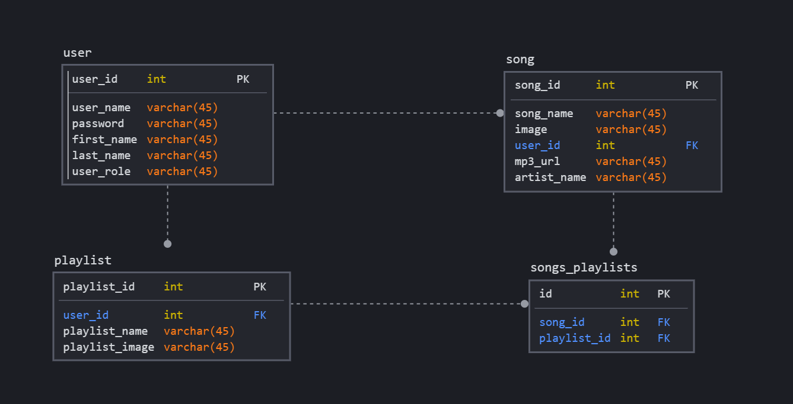

# Melodies Back End

<!-- PROJECT LOGO -->
 

  
  <h3 align="center">Melodies App</h3>
  

    A Music App Allows Users To Listen, Explore And Search For Their Music !
     
    <a href="http://melodieswebapp-env.eba-kgzwebax.us-east-2.elasticbeanstalk.com/"><strong>Go to the API »</strong></a>
     
     
    <a href="https://git.generalassemb.ly/xloli20/MelodiesAppFrontEnd">Melodies App Front End</a>
    ·
    <a href="https://pages.git.generalassemb.ly/xloli20/MelodiesAppFrontEnd/">Melodies App</a>
  

<!-- TABLE OF CONTENTS -->

  
Table of Contents

  <ol>
    <li>
      <a href="#about-the-project">About The Project</a>
      <ul>
        <li><a href="#technologies">Technologies</a></li>
        <li><a href="#relational-database-designerd">Relational Database Design(ERD)</a></li>
        <li><a href="#routes">Routes</a></li>
      </ul>
    </li>
    <li>
      <ul>
        <li><a href="#prerequisites">Prerequisites</a></li>
        <li><a href="#installation">Installation</a></li>
      </ul>
    </li>
    <li><a href="#contributers">Contributers</a></li>
  </ol>

<!-- ABOUT THE PROJECT -->
## About The Project

Melodies is a music app that allows the user to listen, explore and search for their music (the data will be fetched from a third-party API). And the user can click on a (heart icon) to store her/his favorite song so s/he can reach it easily. Also, there's a (plus icon) with a dropdown list so the user can add the song to one of her/his pre-created playlists. and if s/he doesn't have there's a button to redirect them to add playlist page. Also, the users can add their own custom song by filling the form if it's not in the API. The user also can delete/unfavorite, edit their song/playlist.

### Technologies
Here are the technologies we used building this app.
* Spring Boot
* Spring Security
* Java
* JSON Web Token

### Relational Database Design(ERD)

### RESTful Routes

|Method        | Route Path            | Request Body       | Request Parameter |
|:--         | :--             | :--         | :-- |
|GET | /user/index | none | none 
|GET | /user/profile | none | email 
|POST  | /user/registration | user | none
|POST | /user/login | user | none
|PUT | /user/edit | user | email
|PUT | /user/changePassword | user | currentPassword
|DELETE | /user/delete | none | id
|GET | /song/index | none | none 
|POST  | /song/add | song | none
|PUT | /song/edit | song | none
|DELETE | /song/delete | none | id
|GET | /playlist/index | none | none
|GET | /playlist/detail | none | id 
|POST  | /playlist/add | playlist | none
|PUT | /playlist/edit | playlist | none
|DELETE | /playlist/delete | none | id

<!-- CONTACT -->
## Contributers

Alaa Alzahrani - [LinkedIn](https://www.linkedin.com/in/alaa-alz/) - [Github](https://github.com/xloli20)

Afnan Alfulaij - [LinkedIn](https://www.linkedin.com/in/afnan-alfulaij/
) - [Github](https://git.generalassemb.ly/afnanaaf)

